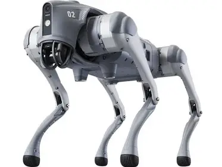
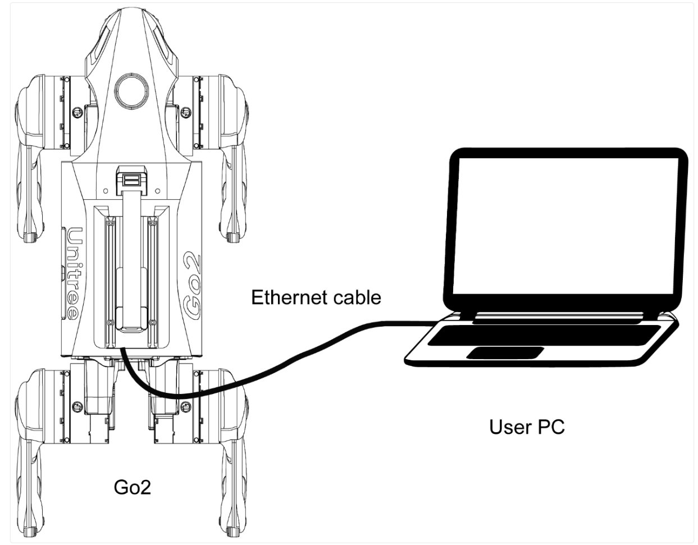
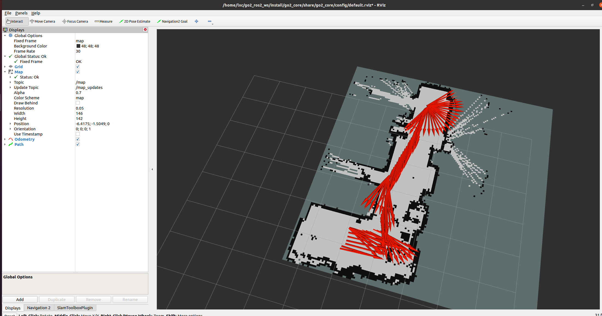
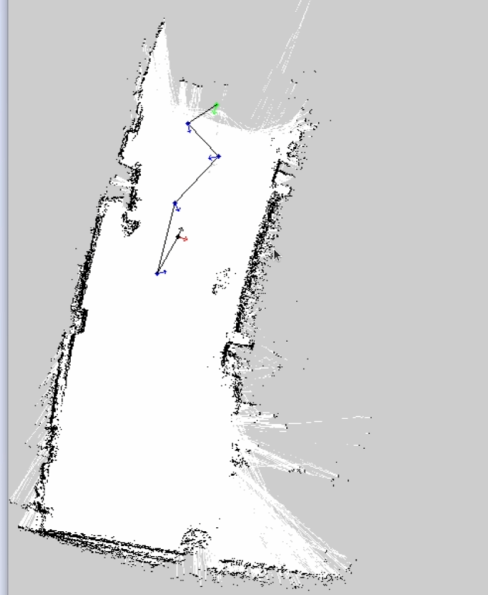
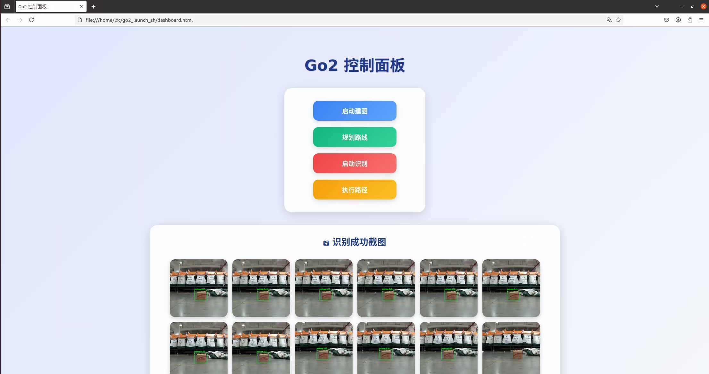

# GO2-Patrol-Nav

<p align="center">
  
  
  
  
  
</p>

<p align="center">
  
</p>

一个基于 **Unitree Go2** 四足机器人的智能巡检导航系统，集成 SLAM 建图、自主导航、目标检测和实时远程控制功能。

## 功能特性

- **SLAM 建图** - 基于 SLAM Toolbox 的实时 2D 地图构建
- **自主导航** - 支持 Nav2 的路径规划与自主避障
- **目标检测** - 基于 YOLOv5 的实时目标识别与监控
- **远程控制** - 通过 WebRTC 实现低延迟音视频传输与远程操控
- **路径管理** - 支持路径规划、录制、回放和仿真
- **Web 控制台** - 基于浏览器的可视化控制界面

## 系统架构

```
go2-patrol-nav/
├── go2_launch_sh/          # 启动脚本与 Web 控制台
├── go2_ros2_ws/           # ROS2 工作空间 (核心功能包)
│   ├── go2_core           # 核心功能包
│   ├── go2_slam           # SLAM 建图
│   ├── go2_navigation     # 导航与路径规划
│   ├── go2_perception     # 感知处理 (点云、激光雷达)
│   └── go2_ros2_toolbox/  # ROS2 工具包源码
├── go2_webrtc_connect/    # WebRTC 通信模块
├── Target_Detect/         # YOLOv5 目标检测模块
├── unitree_ros2/          # Unitree ROS2 接口
└── unitree_sdk2/          # Unitree SDK2
```

### 硬件连接

<p align="center">
  
</p>

- **Go2 机器人** 通过 **网线** 连接到 **控制电脑**
- 默认 IP: `192.168.123.161`
- 确保机器人和电脑在同一网段

## 快速开始

### 环境要求

| 组件 | 配置要求 | 说明 |
|------|---------|------|
| **操作系统** | Ubuntu 20.04 LTS | **仅支持 20.04** |
| **ROS2** | Foxy | Ubuntu 20.04 对应的 ROS2 版本 |
| **Python** | 3.8 | Ubuntu 20.04 自带 |
| **机器人** | Unitree Go2 EDU | 四足机器人 |

> **⚠️ 注意**: 本项目**仅支持 Ubuntu 20.04 + ROS2 Foxy**，在其他系统版本上可能无法正常运行。

### 依赖安装

**系统要求：Ubuntu 20.04 + ROS2 Foxy**

```bash
# 1. 安装 ROS2 Foxy
# 参考 DEPLOYMENT.md 中的详细安装步骤

# 2. 安装 ROS2 依赖包
sudo apt update
sudo apt install -y ros-foxy-navigation2 ros-foxy-slam-toolbox \
    ros-foxy-nav2-bringup ros-foxy-rviz2

# 3. 安装 Python 依赖
pip install torch torchvision opencv-python aiortc aiohttp numpy pyyaml \
    watchdog matplotlib scipy
```

### 项目配置

1. **克隆仓库**
```bash
git clone https://github.com/你的用户名/GO2-Patrol-Nav.git
cd GO2-Patrol-Nav
```

2. **修改配置路径** ⚠️

编辑以下文件，替换为你的实际路径：

**启动脚本路径修改：**
```bash
# 修改 go2_launch_sh/*.sh 中的路径
# 原: cd ~/go2_ros2_ws
# 改为: cd /你的实际路径/go2_ros2_ws

# 原: /home/lxc/anaconda3/envs/video/bin/python
# 改为: 你的Python解释器路径 (如: /usr/bin/python3 或 conda环境路径)
```

**路径执行器IP修改：**
```python
# 修改 go2_ros2_ws/path_runner.py 第145行
# 原: conn = Go2WebRTCConnection(WebRTCConnectionMethod.LocalSTA, ip="192.168.123.161")
# 改为: 你的Go2机器人的实际IP地址
```

### 构建ROS2工作空间

```bash
cd go2_ros2_ws

# 安装ROS2依赖
rosdep install --from-paths src --ignore-src -r -y

# 编译
colcon build --symlink-install --cmake-args -DCMAKE_BUILD_TYPE=Release

#  source环境
source install/setup.bash

# (可选) 添加到.bashrc
echo "source $(pwd)/install/setup.bash" >> ~/.bashrc
```

### 启动机器人

#### 1. SLAM建图模式

```bash
# 启动机器人核心和SLAM
./go2_launch_sh/1_slam.sh

# 在RViz中查看地图
rviz2 -d go2_ros2_ws/src/go2_ros2_toolbox/go2_slam/config/slam.rviz

# 控制机器人移动以扫描环境
# 使用手柄或WebRTC控制台
```

**SLAM 建图效果：**

<p align="center">
  
</p>

机器人在环境中移动，实时构建2D地图。

#### 2. 保存地图

```bash
# 保存当前地图
ros2 service call /slam_toolbox/save_map slam_toolbox/srv/SaveMap \
    "name: {data: '/path/to/save/map.yaml'}"
```

#### 3. 路径规划

```bash
# 加载地图并进行路径规划
cd go2_ros2_ws
python3 path_planner.py map.yaml

# 使用说明:
# - 左键点击并拖动: 设置路径点和朝向
# - 空格/Enter: 确认当前点
# - 右键: 撤销上一个点
# - ESC: 取消临时点
# - Q: 保存并退出
```

**路径规划效果：**

<p align="center">
  
</p>

蓝色点为规划的路径点，红色箭头为起点，绿色箭头为终点。

生成的 `commands.yaml` 包含机器人执行指令。

#### 4. 执行巡检路径

```bash
# 仿真模式 (不连接真实机器人)
./go2_launch_sh/3_path_run.sh
# 选择仿真选项

# 真实执行 (连接Go2机器人)
# 确保:
# 1. 已修改path_runner.py中的IP地址
# 2. 机器人已开机并连接同一网络
# 3. 在commands.yaml所在目录运行
```

#### 5. 目标检测

```bash
# 启动目标检测监控
./go2_launch_sh/4_target_detect.sh

# 检测系统会监控 ./img/pred 目录中的新图片
# 检测结果保存到:
#   - ./img/true/  (检测到目标)
#   - ./img/false/ (未检测到目标)
```

## 模块详情

### 启动脚本 (`go2_launch_sh/`)

| 脚本 | 功能 | 说明 |
|------|------|------|
| `1_slam.sh` | 启动 SLAM 建图 | 启动go2_core和slam_toolbox |
| `2_path_plan.sh` | 启动路径规划GUI | 交互式路径规划工具 |
| `3_path_run.sh` | 执行巡检路径 | 支持仿真和真实执行 |
| `4_target_detect.sh` | 启动目标检测 | 基于YOLOv5的实时监控 |
| `dashboard.html` | Web 控制面板 | 浏览器远程控制界面 |

### ROS2 功能包 (`go2_ros2_ws/`)

- **go2_core**: 机器人核心控制与视频流处理
- **go2_slam**: 基于 SLAM Toolbox 的地图构建
- **go2_navigation**: Nav2 导航配置与参数
- **go2_perception**: 点云处理与激光雷达数据转换
- **go2_sport_api**: 运动控制 API 接口

### 目标检测 (`Target_Detect/`)

基于 YOLOv5 的目标检测系统：

```bash
cd Target_Detect

# 训练自定义模型 (可选)
python yolov5/train.py --data custom_data.yaml --weights yolov5s.pt

# 监控目录配置
# WATCH_DIR    = "./img/pred"    # 输入图片目录
# DETECTED_DIR = "./img/true"    # 检测结果目录
# EMPTY_DIR    = "./img/false"   # 无目标目录
```

### WebRTC 通信 (`go2_webrtc_connect/`)

实现浏览器与机器人的实时通信：

```bash
cd go2_webrtc_connect

# 安装依赖
pip install -r requirements.txt

# 启动WebRTC服务
python go2_webrtc_driver/webrtc_driver.py

# 在浏览器中打开 dashboard.html
```

**Web 控制面板：**

<p align="center">
  
</p>

控制面板提供：
- 启动建图、规划路线、启动识别、执行路径等功能按钮
- 目标识别结果实时显示

## 核心脚本说明

| 脚本 | 路径 | 功能 | 参数 |
|------|------|------|------|
| `path_planner.py` | `go2_ros2_ws/` | 交互式路径规划 | `map.yaml` |
| `path_runner.py` | `go2_ros2_ws/` | 路径执行器 | 读取`commands.yaml` |
| `path_simulate.py` | `go2_ros2_ws/` | 路径仿真测试 | 无 |
| `display_video.py` | `go2_ros2_ws/` | 视频流显示 | 无 |
| `monitor_detect_target.py` | `Target_Detect/` | 目标检测监控 | 无 |

## 常见问题

### Q: path_runner.py 报错 "No such file or directory: 'commands.yaml'"
**A:** 确保在包含 commands.yaml 的目录下运行脚本：
```bash
cd go2_ros2_ws
python3 path_runner.py
```

### Q: 连接机器人失败
**A:** 检查以下几点：
1. 确认机器人IP地址正确（修改path_runner.py第145行）
2. 确认机器人和电脑在同一网络
3. 确认机器人已开机并进入可控制状态
4. 尝试ping机器人IP: `ping 192.168.123.161`

### Q: YOLOv5模型加载失败
**A:**
1. 确认已安装torch: `pip install torch torchvision`
2. 确认模型文件存在: `ls Target_Detect/model/best.pt`
3. 如没有模型，需先训练或下载预训练模型

### Q: ROS2包编译失败
**A:**
```bash
# 清理后重新编译
rm -rf build install log
colcon build --symlink-install

# 或仅编译特定包
colcon build --packages-select go2_core
```

### Q: SLAM建图时地图不更新
**A:**
1. 确认机器人正在移动
2. 检查激光雷达/摄像头数据: `ros2 topic list | grep scan`
3. 在RViz中添加Map显示，选择话题 `/map`

### Q: WebRTC连接失败
**A:**
1. 确认浏览器支持WebRTC (Chrome/Firefox/Edge)
2. 检查防火墙设置
3. 确认机器人IP和端口正确

## 网络配置

### 网络拓扑

本项目使用**网线直连**方式连接机器人和控制电脑：

```
[Go2机器人] <--网线--> [控制电脑]
```

无需路由器，直接通过网线连接即可通信。

### IP配置

- Go2机器人: `192.168.123.161`
- 控制电脑: `192.168.123.xxx` (同网段)

### 默认IP配置

- Go2机器人: `192.168.123.161`
- 控制电脑: `192.168.123.xxx` (同网段)

如需修改，编辑对应脚本中的IP地址。

## 硬件要求

- **机器人**: Unitree Go2 EDU
- **计算单元**:
  - 推荐: NVIDIA Jetson Orin Nano / x86工控机
  - 最低: 4核CPU, 8GB RAM
- **传感器**:
  - 激光雷达 (可选但推荐)
  - 摄像头 (用于目标检测)

## 许可证

本项目各模块遵循其原始许可证：
- ROS2 相关: BSD-3-Clause / Apache-2.0
- YOLOv5: GPL-3.0
- Unitree SDK: 参见 `unitree_sdk2/LICENSE`

## 致谢

- [Unitree Robotics](https://www.unitree.com/)
- [ROS2](https://docs.ros.org/)
- [SLAM Toolbox](https://github.com/SteveMacenski/slam_toolbox)
- [YOLOv5](https://github.com/ultralytics/yolov5)

## 联系我们

如有问题或建议，欢迎提交 Issue 或 PR。

---

<p align="center">Made with ❤️ for robotics</p>
